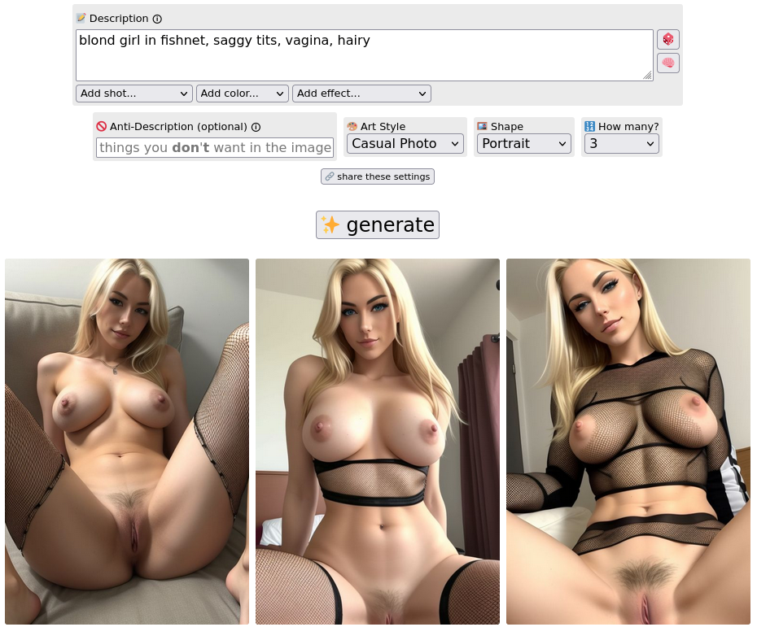

# Description

BohemianDiffusion is a free-of-limits image generation tool, which can generate any kind of image.


# Setup

```
# Requirements: Node version 10+ and NPM version 6+

# Install node dependencies:
$ npm install

# Run the project in watch mode:
$ npm run start

# All changes should be made in the src directory and observed in publicDev
```

# Examples


<details>
<summary>Click to expand: more examples</summary>




</details>